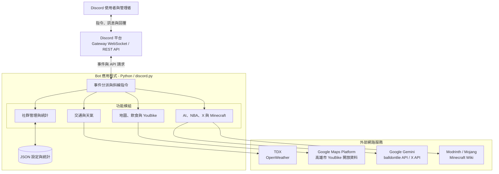

# Discord Life Assistant Bot

本專案是「企業資料通訊」課程的個人期末作品，將天氣、交通、地圖、飲食、娛樂、AI 問答與 Discord 伺服器管理功能整合到同一套 Bot。使用者可以直接在聊天室以斜線指令查詢，也可由 Bot 定時推播天氣或依伺服器事件自動回應。

公開版保留原課堂專題的核心構想與功能流程，並將原本的單檔程式整理為依功能劃分的模組化結構；API 憑證、Discord 頻道及常用連結均改由外部設定檔管理，與公開展示無關的測試用程式則予以移除。

## 系統架構



Bot 透過 Discord Gateway 接收斜線指令、訊息與成員狀態事件，依功能呼叫外部 HTTP API，再將資料配對、篩選、計算及格式化，最後透過 Discord REST API 回覆文字、Embed 或地圖圖片。

## 功能展示畫面

作品集 PDF 中的畫面為配合版面與檔案大小而經過縮放；動態關鍵字回覆、每日天氣推播及路線比較功能的高解析圖片整理於[功能展示頁面](docs/screenshots/README.md)。

## 功能與指令

### 一般工具

| 指令 | 功能 |
|---|---|
| `/hello` | 檢查 Bot 是否在線 |
| `/help` | 自動整理目前已註冊的指令並分頁顯示 |
| `/calc` | 安全計算四則運算、次方、括號與常用數學函式 |
| `/links` | 從自訂 JSON 檔顯示常用資源連結 |

### 天氣資訊

| 指令／事件 | 功能 |
|---|---|
| `/weather` | 查詢指定城市目前天氣、溫度、濕度與降雨量 |
| `/forecast` | 整理指定城市未來三日預報 |
| `/set_weather_channel` | 由管理者設定每日天氣推播頻道 |
| 每日天氣推播 | 依設定的城市、時區及小時自動推播天氣資訊 |

### 高雄公共運輸

| 指令 | 功能 |
|---|---|
| `/bus` | 配對公車路線、方向與站序，顯示各站即時到站資訊 |
| `/metro` | 依站名或站碼查詢捷運站地址與地圖連結 |
| `/metro_liveboard` | 查詢捷運即時到離站資訊 |
| `/metro_first_last` | 查詢捷運站各方向的首末班車 |

### Google Maps、飲食與 YouBike

| 指令 | 功能 |
|---|---|
| `/route_map` | 比較開車、大眾運輸、步行與自行車的時間及距離，繪製最快路線並提供導航連結 |
| `/food_search` | 依地點、餐飲類別、評分及營業狀態搜尋店家 |
| `/find_place` | 搜尋地點並將多筆結果標示於地圖 |
| `/ubike_map` | 查詢高雄指定行政區的 YouBike 站點 |
| `/ubike_near` | 將地標轉換為座標，以 Haversine 距離找出鄰近站點 |
| `/ubike_nsysu` | 快速查詢國立中山大學附近的 YouBike 站點 |

地圖圖片由 Bot 在伺服器端向 Google Static Maps API 取得後，以 Discord 附件回傳，不會將 API Key 放入使用者可見的圖片網址。

### NBA 與社群貼文

| 指令 | 功能 |
|---|---|
| `/nba` | 查詢近期 NBA 賽事 |
| `/nba_today` | 查詢今日 NBA 賽程與比分 |
| `/nba_date` | 查詢指定日期的 NBA 賽程 |
| `/nba_player` | 查詢球員位置、球隊、身高、體重、國籍與大學 |
| `/tweet` | 查詢指定 X／Twitter 帳號的最新貼文 |

### Gemini 問答

| 指令 | 功能 |
|---|---|
| `/ask_gemini` | 結合近期對話脈絡向 Gemini 提問，長回覆會自動分段呈現 |
| `/reset_ai` | 清除使用者自己的近期對話脈絡 |

對話脈絡只保留於 Bot 執行期間的記憶體中，且限制近期六輪，重新啟動後會自動清除。

### Minecraft 資訊

| 指令 | 功能 |
|---|---|
| `/mcmod` | 依關鍵字、資源類型與載入器搜尋 Modrinth |
| `/mctrending` | 查看熱門、最新或近期更新的 Minecraft 資源 |
| `/mc_player` | 查詢玩家 UUID、Skin 與 Cape |
| `/mc_wiki` | 搜尋 Minecraft Wiki 並提供相關條目 |

### Discord 社群管理

| 指令／事件 | 功能 |
|---|---|
| `/add_blocked_term` | 新增禁語並設定禁言分鐘數（管理者） |
| `/remove_blocked_term` | 移除禁語（管理者） |
| `/list_blocked_terms` | 查看禁語與禁言時間（管理者） |
| `/response add` | 新增動態關鍵字回覆（管理者） |
| `/response remove` | 移除動態關鍵字回覆（管理者） |
| `/response list` | 查看目前的關鍵字回覆 |
| `/ranking` | 統計伺服器成員訊息數並顯示排行榜 |
| `/set_game_broadcast` | 設定遊戲狀態廣播頻道（管理者） |
| `/game_status` | 查看成員選擇公開的遊戲狀態 |
| 訊息事件 | 累計訊息數、比對禁語與觸發自訂回覆 |
| 成員狀態事件 | 偵測新開始的遊戲並推播至指定頻道 |

## 專案結構

```text
DiscordBot-GitHub/
├── data/
│   └── resources.example.json     # 可自訂的常用連結範例
├── src/discord_bot/
│   ├── bot.py                     # Bot 啟動、Cog 載入與共用錯誤處理
│   ├── config.py                  # 環境變數與執行設定
│   ├── storage.py                 # JSON 持久化
│   ├── utils.py                   # 分段、距離與安全計算工具
│   └── cogs/
│       ├── general.py             # 一般工具與說明
│       ├── transport.py           # TDX 公車與捷運
│       ├── weather.py             # 天氣查詢與定時推播
│       ├── maps.py                # Google Maps、飲食與 YouBike
│       ├── social_sports.py       # NBA 與 X／Twitter
│       ├── ai.py                  # Gemini 問答
│       ├── minecraft.py           # Minecraft 資訊
│       └── community.py           # 管理、統計與遊戲狀態事件
├── tests/                         # 不需外部 API 的單元測試
├── .env.example
├── Procfile                       # Railway worker 啟動設定
├── pyproject.toml
└── requirements.txt
```

## 安裝與啟動

### 1. 建立 Python 環境

本專案需要 Python 3.11 以上版本。

```bash
python -m venv .venv
source .venv/bin/activate
python -m pip install -e .
```

Windows PowerShell 請改用：

```powershell
.venv\Scripts\Activate.ps1
python -m pip install -e .
```

### 2. 設定環境變數

```bash
cp .env.example .env
```

在 `.env` 中填入需要使用的服務金鑰。只有 `DISCORD_TOKEN` 是啟動必填項目，其餘金鑰可以依需要啟用：

| 環境變數 | 對應功能 |
|---|---|
| `DISCORD_TOKEN` | Discord Bot 登入 |
| `DISCORD_TEST_GUILD_ID` | 開發期間將指令快速同步至單一測試伺服器 |
| `OPENWEATHER_API_KEY` | 天氣查詢與定時推播 |
| `GOOGLE_MAPS_API_KEY` | Directions、Places、Geocoding 與 Static Maps |
| `GEMINI_API_KEY` | Gemini 問答 |
| `TDX_CLIENT_ID`、`TDX_CLIENT_SECRET` | 公車與捷運資訊 |
| `TWITTER_BEARER_TOKEN` | 最新貼文查詢 |
| `BALLDONTLIE_API_KEY` | NBA 賽事與球員資料 |
| `WEATHER_PUSH_CHANNEL_ID` | 選填的預設天氣推播頻道；亦可用管理指令設定 |
| `WEATHER_PUSH_CITY` | 推播城市，預設為 `Kaohsiung` |
| `WEATHER_PUSH_HOUR` | 當地時間的推播小時，預設為 `8` |
| `BOT_TIMEZONE` | 排程時區，預設為 `Asia/Taipei` |

Google Cloud 專案需要啟用 Directions API、Places API、Geocoding API 與 Maps Static API，並建議替金鑰設定 API 與用量限制。

### 3. 設定自訂資源連結

```bash
cp data/resources.example.json data/resources.json
```

編輯 `data/resources.json` 後，內容會顯示於 `/links`。該檔案已加入 `.gitignore`，可保存特定社群使用的連結而不必提交至公開儲存庫。

### 4. 設定 Discord 權限

在 Discord Developer Portal 中啟用：

- Message Content Intent
- Server Members Intent
- Presence Intent

邀請 Bot 時需包含 `bot` 與 `applications.commands` scope。一般查詢功能需要檢視頻道、傳送訊息、嵌入連結與附加檔案；若使用禁語功能，另需授予 Moderate Members 權限。

### 5. 啟動

```bash
python -m discord_bot
```

初次使用時，管理者可在 Discord 內執行 `/set_weather_channel` 與 `/set_game_broadcast` 設定兩種推播頻道。

## 本機資料與隱私

禁語、關鍵字回覆、訊息計數與推播頻道設定會儲存在 `data/bot_data.json`。此檔案不會提交至 GitHub；若公開部署，應依伺服器規範向成員說明訊息計數與狀態廣播的用途。Bot 不會將 Gemini 對話寫入檔案。

## 測試

```bash
PYTHONPATH=src python -m unittest discover -s tests
```

目前測試涵蓋文字分段、地理距離、安全計算器與 JSON 持久化；外部 API 指令需要各服務憑證與網路環境才能進行整合測試。
