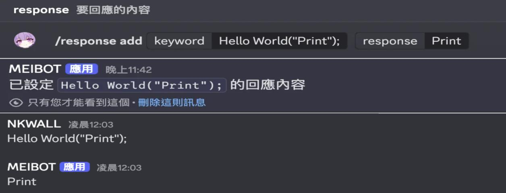
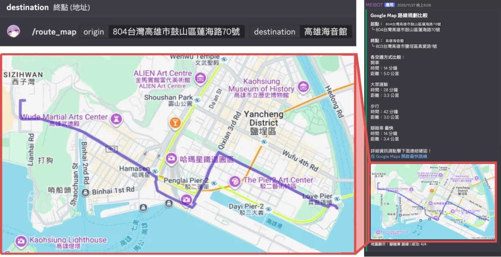

# Discord Bot 功能展示

本頁收錄課程作品集中使用的高解析功能畫面。作品集 PDF 為配合版面與檔案大小而縮放圖片；此處保留較清晰的版本，方便查看 Discord 指令、Bot 回覆與地圖輸出。

## 動態關鍵字回覆

管理者可使用 `/response add` 新增關鍵字與回覆內容；成員訊息符合關鍵字時，Bot 會自動回覆設定內容。

## 每日天氣推播

Bot 會依設定的城市、時區與時間，自動推播當日天氣、溫度、濕度、降雨量及穿著提醒。

## 路線比較與地圖

`/route_map` 會比較不同交通方式的時間與距離，繪製抵達目的地最快方式的路線，並提供 Google Maps 導航連結。

